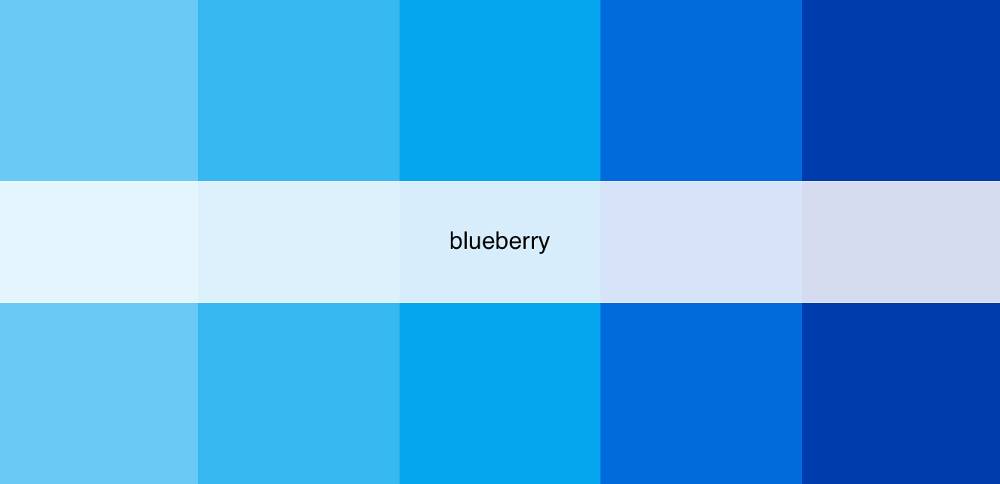

# `ygdesign`: YouGov Design Tools

[](https://www.repostatus.org/#moved) to the [ygverse](https://github.com/yougov-datascience/ygdesign)

The goal of `ygdesign` is to offer a suite of tools to aid in the design and production of data visualization. The package will eventually include many tools, e.g., `ggplot2` theme's, geoms, etc. But for now, the package only includes a color palette generator for all color palettes from the 2022 YouGov brand refresh.

## Use

Users simply pass the name of the desired palette in the main function `yg_palette()`, along with the number of colors desired from the palette (e.g., only 4 from a 5-color palette), and whether "continuous" or "discrete" `type` mapping is desired. If the number of colors, `n`, is `null`, then all colors in the palette will be returned.

## Palettes 

1. `ps_core`: five colors including the primary (1) and secondary (4) core shades
2. `secondary_core`: four colors including the secondary core shades
3. `grapefruit`: five shades of the primary color, "grapefruit"
4. `plum`: five shades of the first secondary color, "plum"
5. `pomegranate`: five shades of the second secondary color, "pomegranate"
6. `blueberry`: five shades of the third secondary color, "blueberry"
7. `avocado`: five shades of the fourth secondary color, "avocado"
8. `full`: 24 colors giving an extensive palette for larger applications
9. `grayscale`: eight colors in the gray scale from "stone gray 7" to "black"

## Displaying palettes

To display or use a specific palette, pass the palette name in quotes to `yg_palette()`.

```{r}
yg_palette("ps_core")
```


```{r}
yg_palette("secondary_core")
```


```{r}
yg_palette("grapefruit")
```


```{r}
yg_palette("plum")
```


```{r}
yg_palette("pomegranate")
```


```{r}
yg_palette("blueberry")
```


```{r}
yg_palette("avocado")
```


```{r}
yg_palette("full")
```


```{r}
yg_palette("grayscale")
```


## Interpolation via the "continuous" `type`

To interpolate between existing colors in a given palette, pass the number of desired shades (`n`), the palette name (`name`), and the type (`type`) to `yg_palette()`. For example, interpolate 50 shades for the "ps_core" and "grayscale" palette:

```{r}
yg_palette(n = 50, name = "ps_core", type = "continuous")
```


```{r}
yg_palette(n = 50, name = "grayscale", type = "continuous")
```


Further, users can increase `n` for larger contexts or to eliminate separation between interpolated shades. Start with: 

```{r}
yg_palette(n = length(yg_palette("full")), name = "full", type = "continuous")
```


which is equivalent to:

```{r}
yg_palette("full")
```

But note the difference with, e.g., `n = 150`:

```{r}
yg_palette(n = 150, name = "full", type = "continuous")
```


Or with `n = 500`:

```{r}
yg_palette(n = 500, name = "full", type = "continuous")
```


Of note, users can declare "discrete" in the `type` argument if working with discrete class data (e.g., factors).

## How do I get `ygdesign`? 

`ygdesign` is under active development at this repo. Engagement and collaboration of any kind is encouraged, whether via filing an [issue](https://github.com/pdwaggoner/ygdesign/issues) or submitting a [pull request](https://github.com/pdwaggoner/ygdesign/pulls) with enhancements or bug fixes. 
